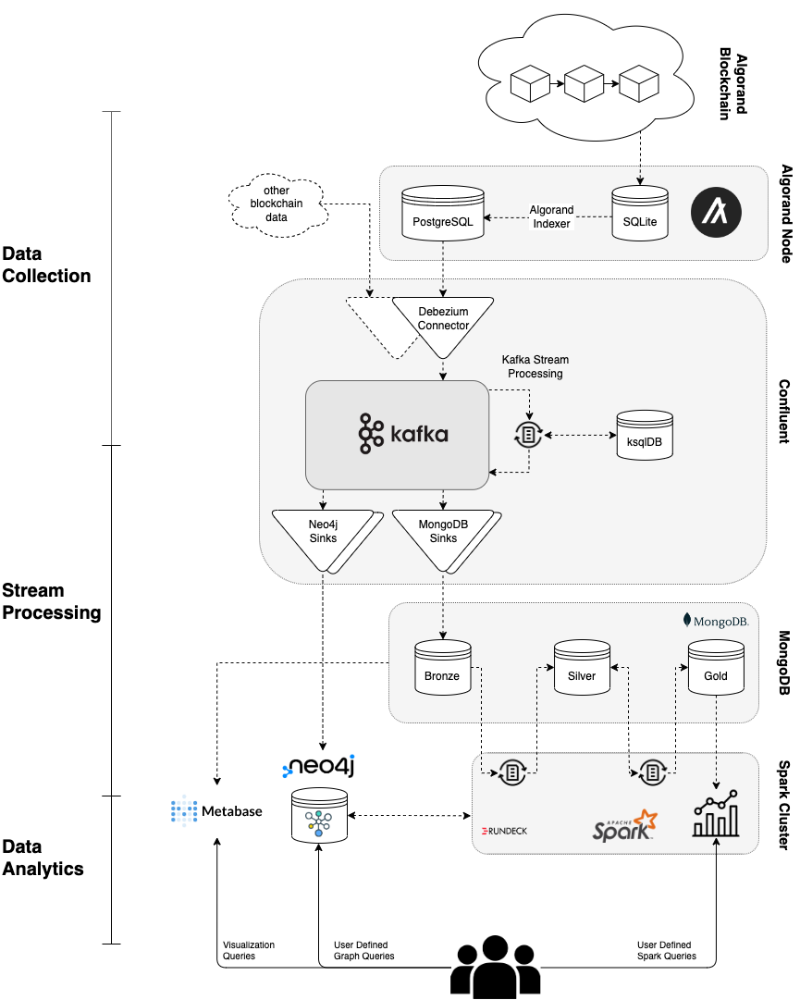
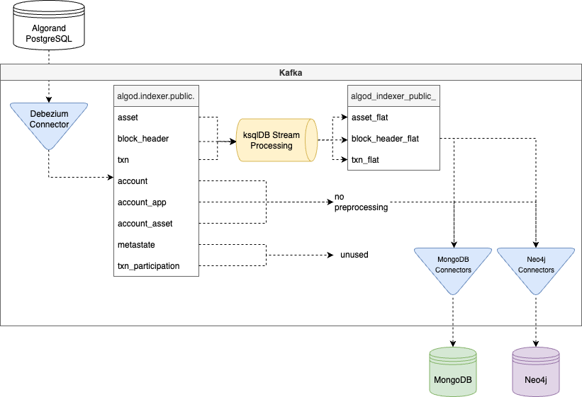
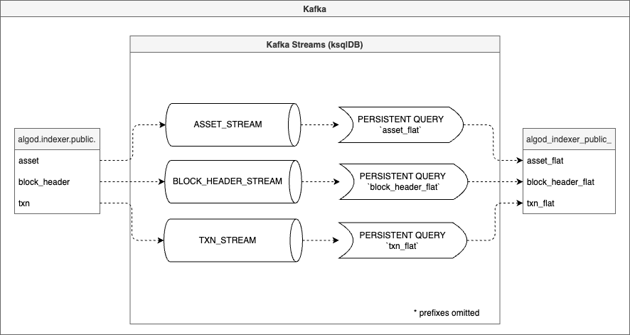
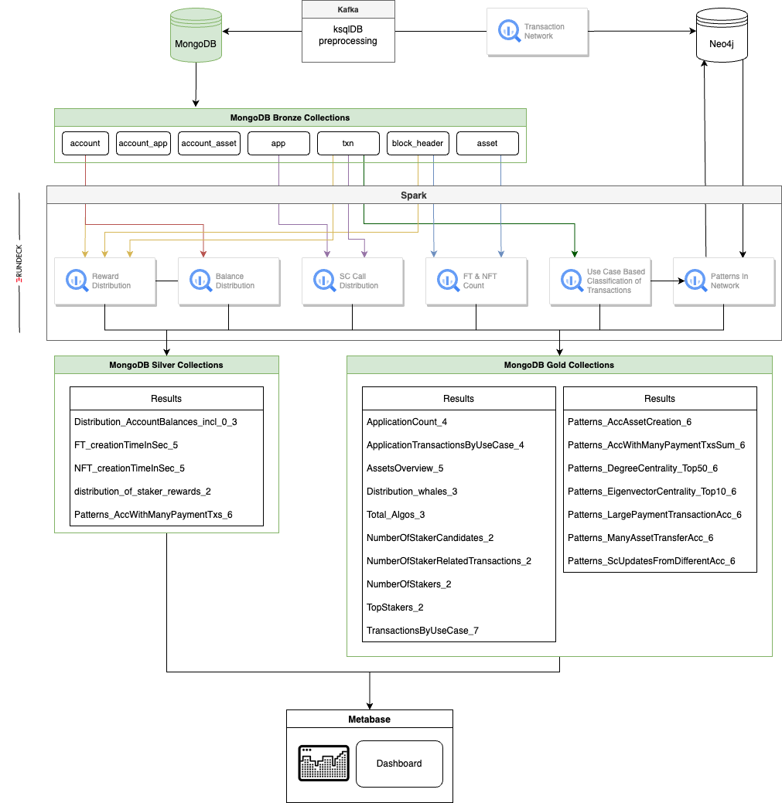

# README

This repository contains the result of our master project at University of Zurich in Data Science. Within 6 months, a team of four designed and implemented an architecture for cross-platform blockchain data analysis together with the UZH Blockchain Center ([https://www.blockchain.uzh.ch/](https://www.blockchain.uzh.ch/)). The architecture is a fist viable proof of concept and very likely to evolve. The deployment process is thus not streamlined. This repository should rather serve as an overview and guideline.

## Abstract

The Blockchain Observatory allows to perform fast real-time analysis of blockchain data. As a proof of concept, a use case is applied based on the Algorand blockchain. Multiple modern and powerful systems build the core of the architecture: Apache Kafka and its ecosystem for data collection and stream processing, MongoDB as a streaming storage layer, Apache Spark for continuous, compute- intensive investigations and Neo4j for comprehensive graph analytics. The proposed architecture represents a sophisticated and interoperable system to handle high throughput and large amounts of data. It is targeted towards expandability for additional blockchains and other downstream analytical systems through the use of Kafka Connect. The use case based on Algorand demonstrates that the platform requires large amount of compute resources and storage. We also conclude that an initial collection of all data up to the current state of the Algorand blockchain consumes a considerable amount of time. Furthermore, due to the variety of blockchains and the lack of standardisation, adding a blockchain to the platform requires an in-depth analysis of the inherent data schema to adapt data collection, stream processing and analytical queries.

For full-text access, please contact the owner of this repository.

## Architecture Overview

In the **data collection** phase, we ingest data from a full Algorand node into a stream through the use of Apache Kafka and its ecosystem. The Debezium Kafka connector is used to collect the change stream into individual Kafka topics per table. Subsequently, in the **stream processing** phase, this extracted data is transformed for further processing and more convenient analytics. The transformed data is then stored to a distributed NoSQL database called MongoDB and to another NoSQL database called Neo4j, to provide scalability for further blockchain data. This persistence layer then serves as data interface for analytical, in-memory batch processing using Apache Spark in the **data analytics** phase. The result of these queries is then stored in higher level data tables in MongoDB, which can be conveniently retrieved by users of the Blockchain Observatory or by dashboards like Metabase.

## Phase 1: Data Collection with the Kafka Ecosystem.

## Phase 2: Stream Processing with ksqlDB.

## Phase 3: Downstream processing and data analytics layer.

